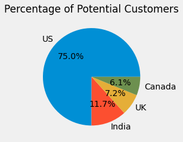

# Market Analysis for Targeted Ads

In this project, I anlyze customer survey data for an e-learning company to determine the top two markets for targeted advertisement.

After performing outlier treatment to obtain a representative sample, I suggest three advertising strategies based on the findings from my analysis along with a dashboard for easy interpretation of my analysis.

